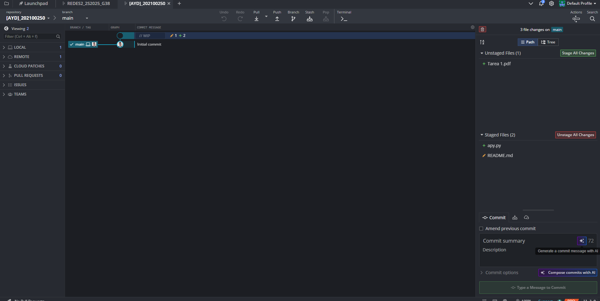
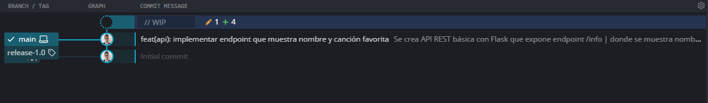
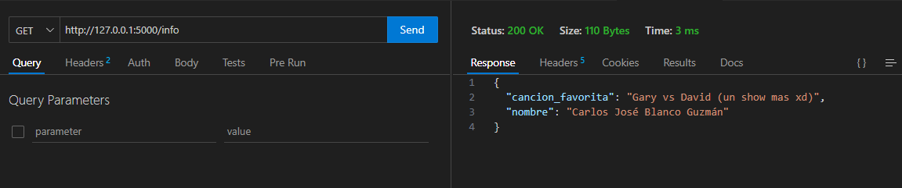
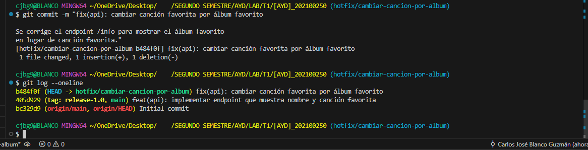
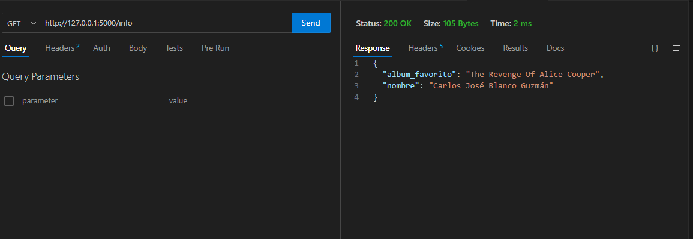
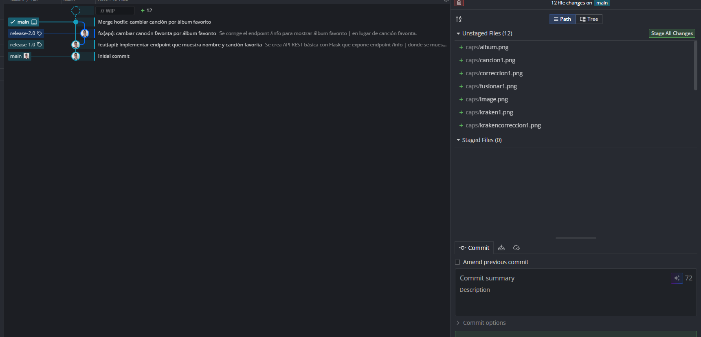

# Capturas procedimiento

#### reparando archivo.py

---
#### Primer commit realizado

---
#### Funcionamiento endpoint1(cancion)

---
#### Rama fix

---
#### Segundo commit + tag realizado

---
#### Funcionamiento endpoint1(album)

---
#### final + (falta commit de carpeta caps + markdown)

