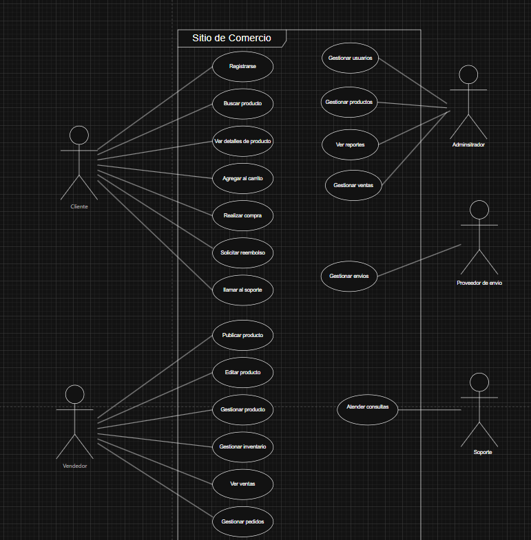

# Requerimientos para sitio web de ventas online (eBay, Amazon, Walmart)

## Requerimientos Funcionales
- Registro de usuarios (clientes, vendedores, administradores)
- Inicio de sesión y gestión de sesiones seguras
- Búsqueda y filtrado de productos
- Visualización de productos con detalles, imágenes y valoraciones
- Carrito de compras
- Procesos de pago y checkout
- Gestión de pedidos (creación, seguimiento, historial)
- Gestión de inventario para vendedores
- Publicación y edición de productos por vendedores
- Valoración y comentarios de productos
- Gestión de devoluciones y reembolsos
- Notificaciones (email, SMS, en la plataforma)
- Soporte y atención al cliente
- Panel de administración para gestión de usuarios, productos y ventas
- Generación de reportes y estadísticas
- Integración con métodos de pago (tarjeta, PayPal, etc.)
- Integración con servicios de envío y seguimiento

## Requerimientos No Funcionales
- Seguridad (protección de datos, cifrado de contraseñas, prevención de fraudes)
- Escalabilidad (capacidad para soportar muchos usuarios y transacciones simultáneas)
- Disponibilidad (alta disponibilidad, tolerancia a fallos)
- Rendimiento (tiempos de respuesta rápidos)
- Usabilidad (interfaz intuitiva y accesible)
- Compatibilidad (funcionamiento en diferentes dispositivos y navegadores)
- Mantenibilidad (facilidad de actualización y corrección de errores)
- Privacidad (cumplimiento de normativas como GDPR)
- Auditoría y registro de actividades
- Localización e internacionalización (soporte para varios idiomas y monedas)

## Actores
- Cliente/Comprador
- Vendedor
- Administrador
- Proveedor de servicios de envío
- Soporte/Atención al cliente

## Diagrama de Casos de Uso
