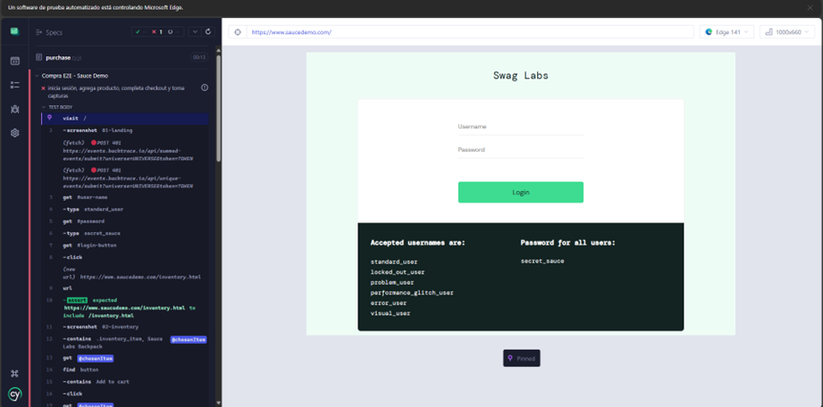
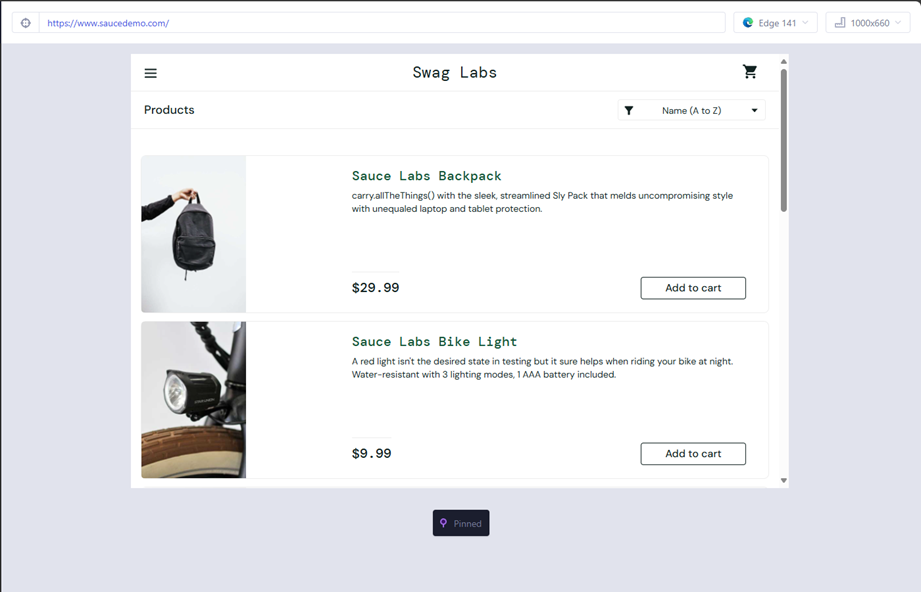
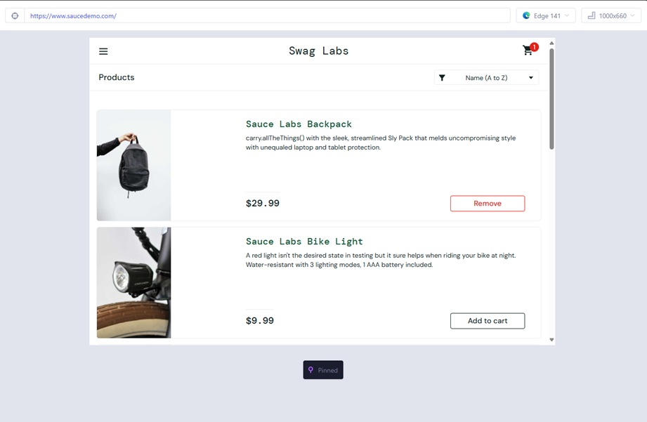
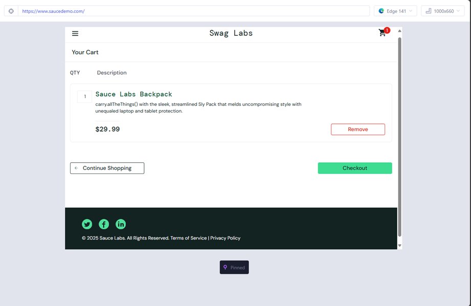
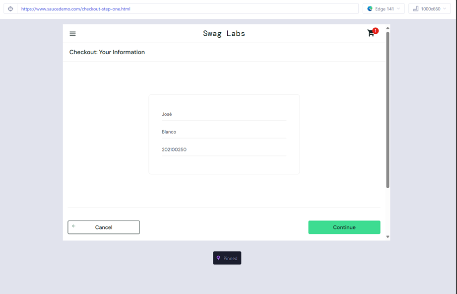
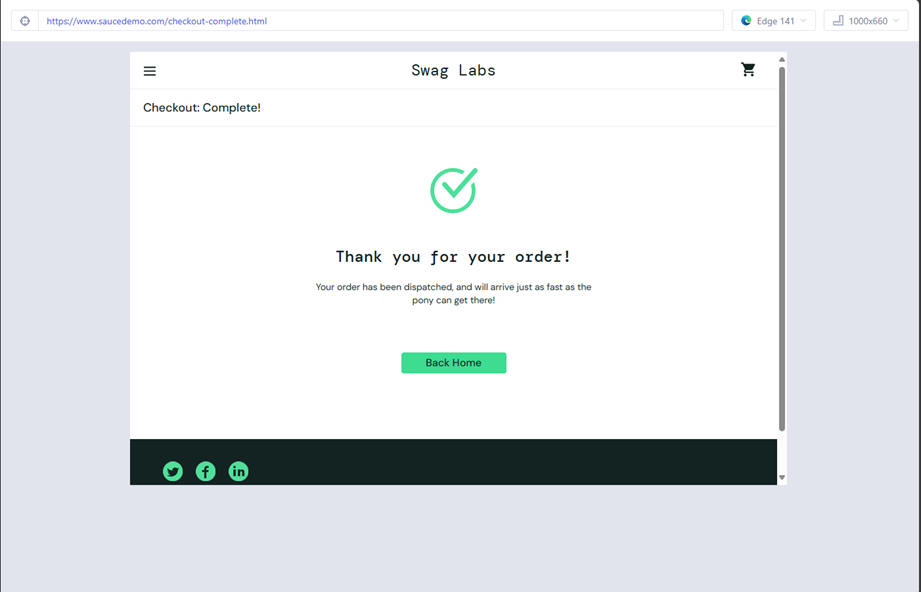

# Tarea 4 - Prueba E2E con Cypress
**Análisis y Diseño de Sistemas 1**

---

- **Nombre:** José Blanco
- **Carnet:** 202100250

---


## 2. Flujo  de la Prueba - Capturas 

### 2.1 Página de Login 

**Descripción:** Página inicial con el formulario de autenticación. Se muestran los campos para ingresar Username y Password.



---

### 2.2 Inventario de Productos

**Descripción:** Después de un login exitoso, se muestra el catálogo completo de productos disponibles (Backpack, Bike Light, Bolt T-Shirt, etc.).



---

### 2.3 Producto Agregado al Carrito

**Descripción:** El producto "Sauce Labs Backpack" ha sido agregado al carrito. El botón cambia a "Remove" y el badge del carrito.



---

### 2.4 Vista del Carrito de Compras

**Descripción:** Página "Your Cart" mostrando el producto seleccionado con su descripción, precio y cantidad.



---

### 2.5 Información de Checkout (Paso 1)

**Descripción:** Formulario de información del comprador completa.



---

### 2.6 Resumen de la Orden (Overview)

**Descripción:** Página "Checkout: Overview" mostrando el resumen completo de la orden, incluyendo el producto, precios individuales, impuestos y el total a pagar.



---


---

## 3. Código Fuente de la Prueba E2E

```javascript
const STUDENT = {
  firstName: 'José',
  lastName: 'Blanco',
  postalCode: '202100250'
}

describe('Compra E2E - Sauce Demo', () => {
  it('inicia sesión, agrega producto, completa checkout y toma capturas', () => {
    // Login
    cy.visit('/')
    cy.screenshot('01-landing')

    cy.get('#user-name').type('standard_user')
    cy.get('#password').type('secret_sauce')
    cy.get('#login-button').click()
    cy.url().should('include', '/inventory.html')
    cy.screenshot('02-inventory')

    // Seleccionar un producto 
    cy.contains('.inventory_item', 'Sauce Labs Backpack')
      .as('chosenItem')

    cy.get('@chosenItem').find('button').contains('Add to cart').click()
    cy.get('@chosenItem').find('.inventory_item_name').should('be.visible')
    cy.screenshot('03-product-added')

    // Ir al carrito
    cy.get('.shopping_cart_link').click()
    cy.url().should('include', '/cart.html')
    cy.screenshot('04-cart')

    // Checkout - información
    cy.get('[data-test="checkout"]').click()
    cy.url().should('include', '/checkout-step-one.html')
    cy.get('#first-name').type(STUDENT.firstName)
    cy.get('#last-name').type(STUDENT.lastName)
    cy.get('#postal-code').type(STUDENT.postalCode)
    cy.screenshot('05-checkout-info')

    cy.get('[data-test="continue"]').click()
    cy.url().should('include', '/checkout-step-two.html')
    cy.screenshot('06-overview')

    // Finalizar compra
    cy.get('[data-test="finish"]').click()
    cy.url().should('include', '/checkout-complete.html')
    cy.contains('THANK YOU FOR YOUR ORDER').should('be.visible')
    cy.screenshot('07-complete')
  })
})
```

### Explicación del Código

1. **Constante STUDENT:** Define los datos personales del estudiante (nombre, apellido y carnet) que se utilizarán en el formulario de checkout.

2. **Login:** La prueba inicia visitando la página principal, ingresa las credenciales (`standard_user` / `secret_sauce`) y hace click en el botón de login.

3. **Selección de Producto:** Busca el producto "Sauce Labs Backpack" en el inventario y lo agrega al carrito.

4. **Carrito:** Navega a la vista del carrito para verificar que el producto fue agregado correctamente.

5. **Checkout:** Completa el formulario de información con los datos del estudiante (nombre, apellido y carnet como código postal).

6. **Overview:** Revisa el resumen de la orden antes de finalizar.

7. **Confirmación:** Finaliza la compra y verifica que aparece el mensaje de confirmación.

8. **Screenshots:** En cada paso crítico se toma una captura de pantalla automáticamente usando `cy.screenshot()`.

---

## 4. Para la ejecución


### Instalación
```powershell
npm install
```

### Ejecución en Modo Interactivo
```powershell
npm run cypress:open
```

---
